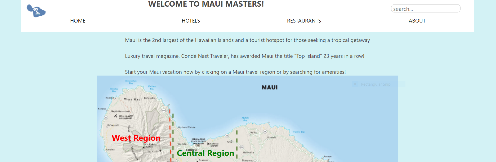

# Maui Masters 

### Link to our Heroku APP 
[Maui Masters App](https://pure-beyond-09585.herokuapp.com/)

### Description of the Project 
Our application is helpful for any potential first time Maui vacationers to find information that can ease the burden of planning a vacation. The application would help users find hotels in the primary vacation regions of the Hawaiian island. These regions consist of the West, South, and Central portions of Maui. The purpose of our application  is to help these users find a hotel that they would like to stay at based on certain factors such as raitings, types of rooms, and location. In addition to information pertaining to the hotel, users will also be able to search for different types of dining options. When users are searching for different restaurants in the area, they will be able to find information by restaurant location, cuisine types, and price ranges. Planning the perfect vacation can be a difficult task in itself, therefore we hope our application would make things a bit easier by putting all information in one convenient package so you can spend less time stressing and more time relaxing. 

### Target Browser 
Our application is able to run Android Platforms such as Pixel 2 and Pixel 2XL.
Also, Iphone 6/7/8/Plus and X. Yet, we want to point out that our applicatin works better on 
a full browser on Windods or Mac OS. 

# Developer Manual 

## How to Install application and all dependencies
1. Clone this repository through Github Desktop or through Terminal.
2. Open repository in VSCode Terminal or Terminal application.
3. type npm install into terminal window and run
4. The application should now be set to use. 

## How to run application on a server 
1. Open repository in VSCode terminal or Terminal application.
2. Run npm start. There should be no errors.
3. In a web browser, go to url: http://localhost:3000

## To run tests for software 

There are no prewritten tests in the source repository, but you can use Cypress to run your own written tests.

1. Open two terminals and make sure you are in the main project directory
2. In the first terminal, run npm start.
3. In the second terminal run npm test. 

# Server application APIs
 /api/hotel - API route that will get all the informartion regarding hotels in Maui this is tied to the hote_overview table in the database from MySQL

- GET - Logs to console response query from URL. returns response 'Got a GET request from /api'.

 /api/restaurant - API route that gets all the information regrding the restaurants in the island of MAUI. This API is tied to the restaurants table in the databse from MySQL

 - GET - Logs to console response query from URL. returns response 'Got a GET request from /api'.

 /api/comments - API route that allow the users to leave a comment on individual hotels. These comments can be compliment or a complaint from the users. Also, users have the ability to delete the comments they made in the past.

 - GET - Logs to console response query from URL. returns response 'Got a GET request from /api'.

 - POST - obtains course name from request body to fetch url. fetch data json from comments API and returns JSON response.

- PUT - returns response 'Got a PUT request at /api'.

- DELETE - It deletes resources. In this case it will allow users to delete their comments if they wish to do so. 

 /api/region - API route that allows to get the REGION information for hotels or restaurants. This API is vital to be able to filter out the hotels and restaurants by the region they reside in. This API is tied to the location table on MySQL. 

 - GET - Logs to console response query from URL. returns response 'Got a GET request from /api'.

 /api/room - API route that allows to grab information about the rooms offerred by the hotels. We used this API to be retrieve the type of views available at the hotels. 

 - GET - Logs to console response query from URL. returns response 'Got a GET request from /api'.

 /api/cuisine - API route that allows to grab the informtion for the type of cuisine every restaurant offers. For example it allows to filter the restaurants by "American" or "Thai" style food. 

- GET - Logs to console response query from URL. returns response 'Got a GET request from /api'.

# Known Bugs and Future Development

### Bugs:

- When a user selects an individual hotel after using the filters then, hits the back button on the browser, the page is blank but the checkboxes remain checked. 

- When using multiple selections there can be repeated results if criteria is matched. We think this is due to the fact that each checkbox has its own function. 

- When making a submition for a comment, sometimes after the comment is submitted the form remains filled out with the content that was just submitted. 

### Future Development:

In the future our application would benefit from more interactivity. For example adding a map on all pages, using the search bar for restaurants, hotels, amenities, type of room etc... Also, it could benefit from direct interaction with the hotels where the application can 
provide information on the availabilty of rooms.  

